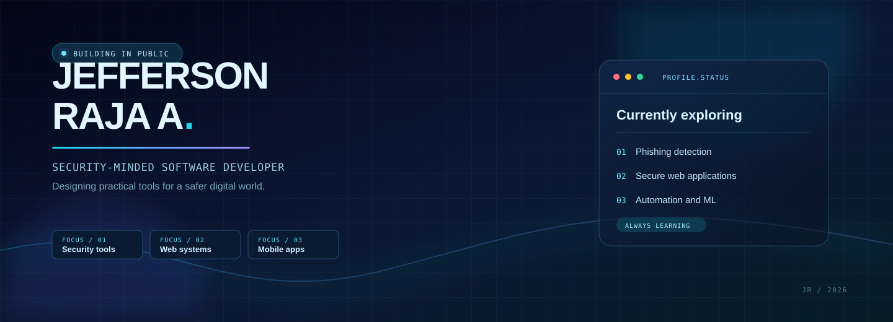

 

<table>
<tr>
<td width="61%" valign="top">

## A little about me

I am a cybersecurity-focused developer who turns technical ideas into useful, user-friendly software. I am especially interested in building security tools, resilient web experiences, and automation that solves real problems.

<blockquote>
  <strong>Currently:</strong> improving phishing detection, strengthening my web-security skills, and learning React Native, Kotlin, and cloud architecture.
</blockquote>

</td>
<td width="39%" valign="top">

## The stack

Python &bull; JavaScript &bull; React &bull; Android &bull; Security

</td>
</tr>
</table>

## Featured builds

<table>
<tr>
<td width="50%" valign="top">

SECURITY / 01

### [Phishing Detector Extension](https://github.com/JEFFERSON-007/phishing-extension)

Browser-based phishing-message detection built with JavaScript and Chrome APIs.

`JavaScript` &nbsp; `Chrome APIs` &nbsp; `Security`

</td>
<td width="50%" valign="top">

SECURITY / 02

### [Web Vulnerability Scanner](https://github.com/JEFFERSON-007/WEB-APPLICATION-VULNERABILITY-SCANNER)

A hands-on project for exploring practical web-security testing concepts.

`JavaScript` &nbsp; `Web Security` &nbsp; `Testing`

</td>
</tr>
<tr>
<td width="50%" valign="top">

SECURITY / 03

### [File Integrity Checker](https://github.com/JEFFERSON-007/FILE-INTEGRITY-CHECKER)

Python tooling for file monitoring and integrity verification.

`Python` &nbsp; `Hashing` &nbsp; `Automation`

</td>
<td width="50%" valign="top">

SECURITY / 04

### [Advanced Encryption Tool](https://github.com/JEFFERSON-007/ADVANCED-ENCRYPTION-TOOL)

An applied cryptography project focused on secure data handling.

`Python` &nbsp; `Cryptography` &nbsp; `Security`

</td>
</tr>
</table>

[Explore all repositories](https://github.com/JEFFERSON-007?tab=repositories)

## Contribution telemetry

 

<strong>Open contribution calendar</strong>

 

<picture>
  <source media="(prefers-color-scheme: dark)" srcset="https://raw.githubusercontent.com/JEFFERSON-007/JEFFERSON-007/output/github-contribution-grid-snake-dark.svg" />
  
</picture>

 

Built with curiosity, consistency, and a security-first mindset. 

